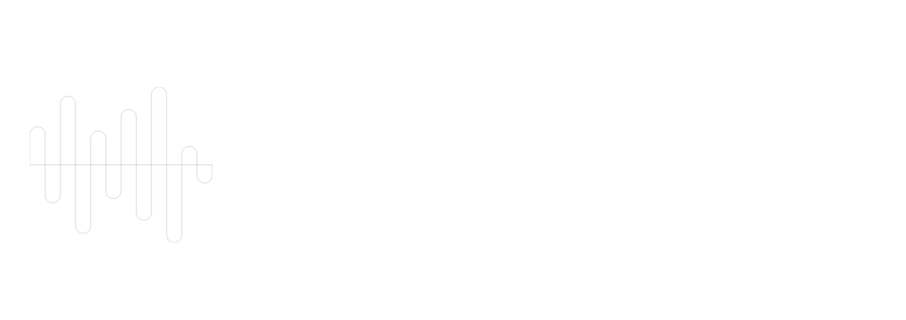

# 🎵 Music Visualizer

> **Experience Music Like Never Before**

Transform your favorite songs into stunning visual art with our AI-powered music visualizer. Watch as every beat, melody, and rhythm comes alive through breathtaking real-time animations.

## ✨ What Makes This Special

🤖 **AI Beat Prediction** - Smart algorithms predict and visualize beats before they hit  
🎨 **5+ Visualization Modes** - From pulsing waves to geometric patterns  
🎵 **Real-time Audio Analysis** - Every frequency analyzed and visualized instantly  
🌈 **Dynamic Themes** - Beautiful color schemes that adapt to your music  
⚡ **Instant Access** - No downloads, no registration - just pure music visualization  

## 🚀 How It Works

1. **Visit the Homepage** - Interactive ripple background welcomes you
2. **Click "Launch Visualizer"** - Instant access to the music visualizer
3. **Upload Your Music** - Drop any audio file or use your microphone
4. **Watch the Magic** - Your music transforms into living, breathing art
5. **Customize Your Experience** - Switch themes, adjust settings, and explore different visualization modes

## 🎯 Perfect For

- **Music Lovers** who want to see their favorite songs in a new way
- **Content Creators** looking for stunning visual backgrounds
- **Party Hosts** wanting to create an immersive atmosphere
- **Musicians** who want to visualize their compositions
- **Anyone** who appreciates the intersection of music and art

## 🌟 Key Features

### Multiple Visualization Modes
- **Wave Spectrum** - Classic frequency bars that dance to your music
- **Circular Patterns** - Mesmerizing radial visualizations
- **Geometric Shapes** - Abstract forms that pulse with rhythm
- **Particle Systems** - Thousands of dots creating flowing patterns
- **AI Beat Sync** - Advanced patterns that predict and follow musical structure

### Customization Options
- **Theme Selection** - Choose from Ocean, Neon, Sunset, and more
- **Color Intensity** - Adjust vibrancy to match your mood
- **Animation Speed** - Control the pace of visual effects
- **Audio Sensitivity** - Fine-tune responsiveness to different music types

### User-Friendly Experience
- **Drag & Drop** - Simply drop your music files to start
- **Browser-Based** - Works instantly in any modern web browser
- **Mobile Friendly** - Optimized for phones and tablets
- **No Account Required** - Start visualizing immediately

## 🎪 Experience Gallery

From gentle ambient waves to explosive electronic beats, every genre gets its moment to shine:

- **Classical Music** → Elegant flowing patterns that follow orchestral dynamics
- **Electronic/EDM** → High-energy geometric explosions and neon effects  
- **Rock/Metal** → Powerful wave formations with intense color bursts
- **Jazz** → Smooth, improvisational visual flows that mirror musical complexity
- **Hip-Hop** → Sharp, rhythmic patterns that emphasize bass and beats

## 🌐 Get Started

Ready to see your music in a whole new light?

**[🎵 Launch Music Visualizer →](https://teHenglay.github.io/Music-Visualizer)**

---

*Turn up the volume, close your eyes for a moment, then open them to a world where music and visuals dance together in perfect harmony.*